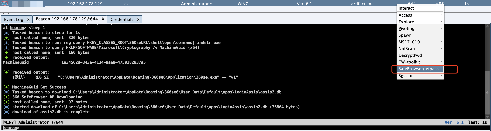
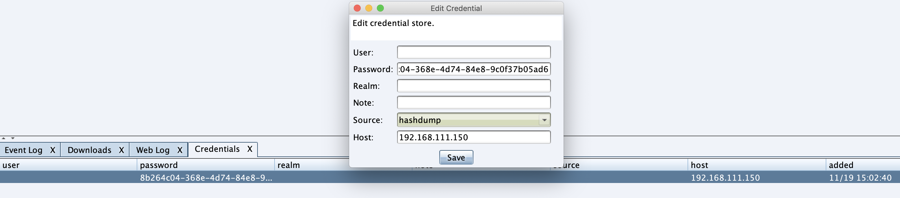
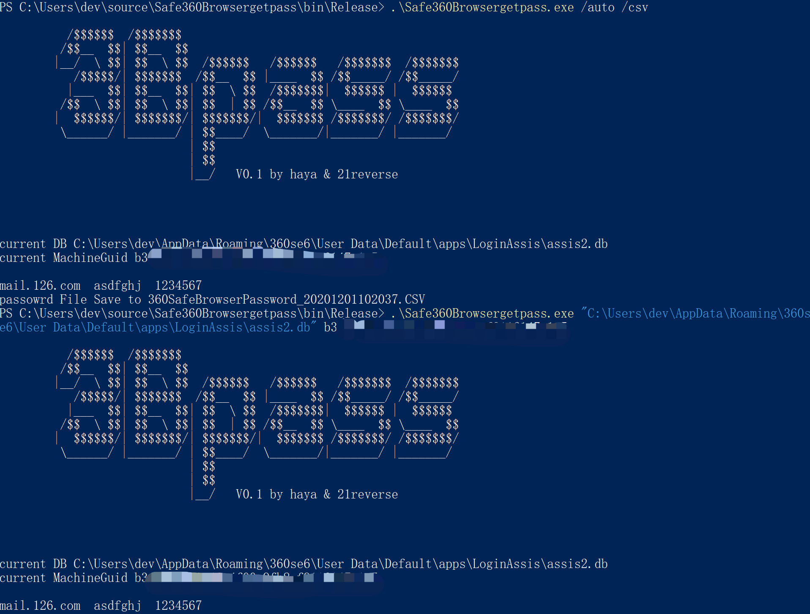
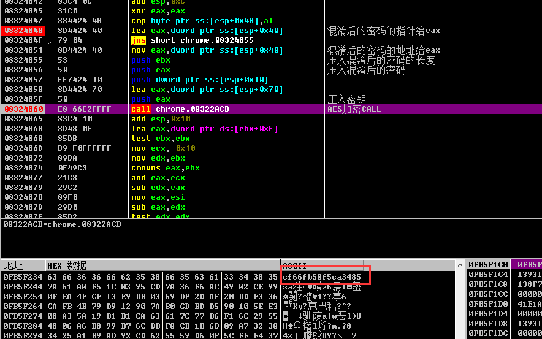

### 1.简介

​	这是一个一键辅助抓取360安全浏览器密码的CobaltStrike脚本以及解密小工具，用于节省红队工作量，通过下载浏览器数据库、记录密钥来离线解密浏览器密码。

​	`360SafeBrowsergetpass.cna`主要用与记录解密所需要的信息用于离线解密，`3Bpass`主要用于解密浏览器密码，支持本机自动导出以及离线解密。

### 2.用法

##### 2.1. Aggressor scripts 搜集信息

加载Aggressor scripts后，`beacon`右键打开菜单执行`SafeBrowsergetpass`即可

执行后将下载浏览器数据库，记录密钥`MachineGuid`到`Credential`

##### 2.2 3Bpass解密数据库

`3Bpass`使用C#编写，可以将`360SafeBrowsergetpass.cna`收集到的`MachineGuid`、`assis2.db`解密，`/auto`选项支持自动检索本机解密当前用户的数据，`/csv`选项支持导出csv格式数据库。

### 3.技术细节

​	这里非常感谢[BrowserView](http://www.liulanqicode.com/)作者做出的贡献，公开了部分解密思路, 也十分感谢TkBinary师傅的指导，根据这些提示后来我们共同逆向了算法并编写解密工具。在实战中我发现GUI抓密码的情况不多，更多的是命令行形式，又苦于目前没有抓取360安全浏览器密码的命令行工具，所以跟进看了一下。

​	数据库使用sqlite加密，通过搜索模块中的sqlite3_open()等函数发现chrome.dll存在“sqlite3_open assis2.db”字符串等其他关键函数。对此dll进行逆向最后可以找到如下密钥：

整体加密流程为：MachineGuid --> Base64 --> AES-ECB 128

更加具体的解密细节请移步看雪论坛：https://bbs.pediy.com/thread-263905.htm

然后就是写cs脚本以及C#工具，这里不再赘述。

### 4.其他

当用户登录360浏览器用户中心以后，会再多两层解密，虽然方式和之前类似，也可以逆出密钥，但是密钥似乎是动态生成的，目前还在努力中，发出来也是想大家一起看看。

此工具仅用于合法渗透测试，切勿违法，一切与本人无关！
