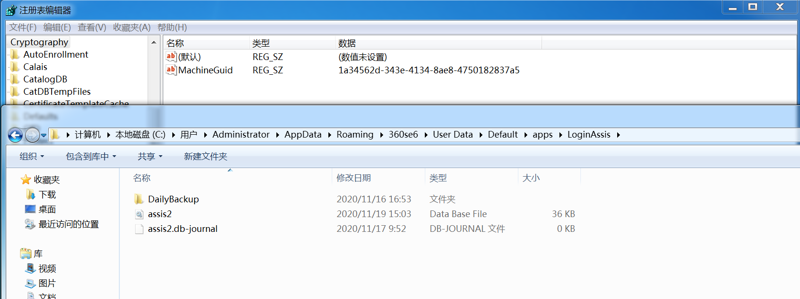
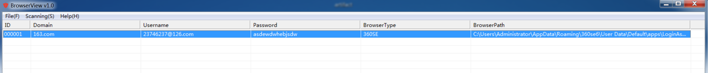
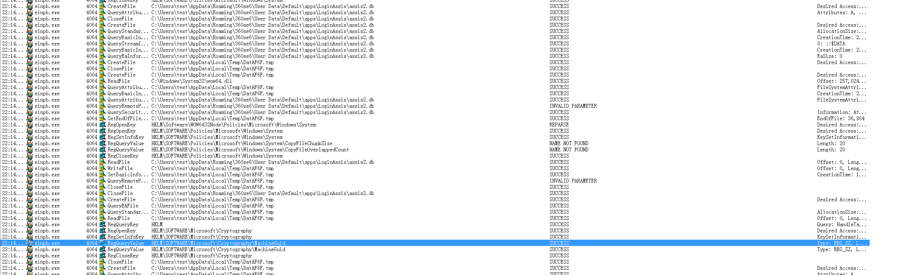

### 1.简介

​	这是一个一键辅助抓取360安全浏览器密码的CobaltStrike脚本，用于节省红队工作量，通过下载浏览器数据库、记录密钥来离线解密浏览器密码。

### 2.用法

加载Aggressor scripts后，`beacon`右键打开菜单执行`SafeBrowsergetpass`即可

执行后将下载浏览器数据库，记录密钥`MachineGuid`到`Credential`

### 3.离线解密数据库

​	攻防演练中红队的时间非常珍贵，`SafeBrowsergetpass`执行后所有数据存储在C2服务器，可以稍后在本地对浏览器密码进行解密。

​	只需要替换本地注册表`HKEY_LOCAL_MACHINE\SOFTWARE\Microsoft\Cryptography\MachineGuid`，替换原来360浏览器的`assis2.db`，通常路径为`C:\Users\Administrator\AppData\Roaming\360se6\User Data\Default\apps\LoginAssis`,即可通过BrowserView进行本地解密。

### 4.技术细节

​	这里非常感谢BrowserView作者做出的贡献，公开了解密算法，并提供了BrowserView工具用于解密浏览器密码。在实战中我发现GUI抓密码的情况不多，更多的是命令行形式，又苦于目前没有抓取360安全浏览器密码的命令行工具，个人能力有限，所以想了一个曲线救国的法子来解决问题。

​	具体解密算法以及BrowserView下载请移步：http://www.liulanqicode.com/

​	BrowserView加了壳，目前也被各大杀软追杀，通过Process Monitor我们可以得知，这个工具查询了`HKEY_LOCAL_MACHINE\SOFTWARE\Microsoft\Cryptography\MachineGuid`的值，以及`C:\Users\Administrator\AppData\Roaming\360se6\User Data\Default\apps\LoginAssis\assis2.db`，也就是说，获取了这两个值，替换我们本机的值，就可以通过这个工具离线解密了。

​	然后就是写cs脚本，这里不再赘述。